# Magic-Pencil
implementation of "Combining Sketch and Tone for Pencil Drawing Production"

## requirement

    python 3.5
    numpy 1.13
    pytorch 1.0
    pillow 4.2

## Run

    python pencil.py filename 
    

## Productions

Here are some original picture and productions in some steps .

I am Iron Man

    

	
    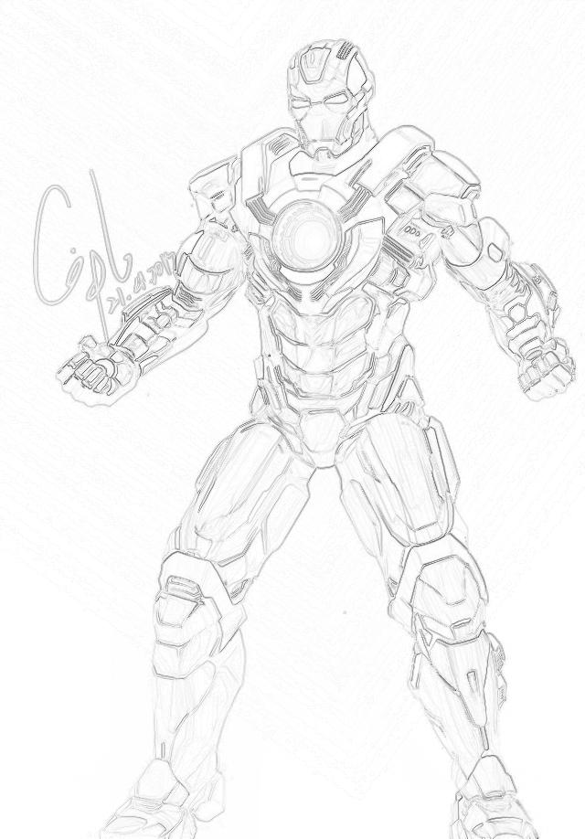
    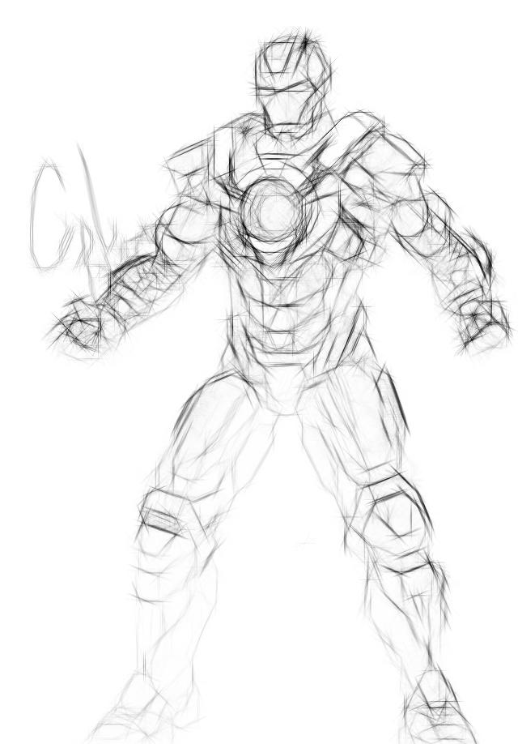
    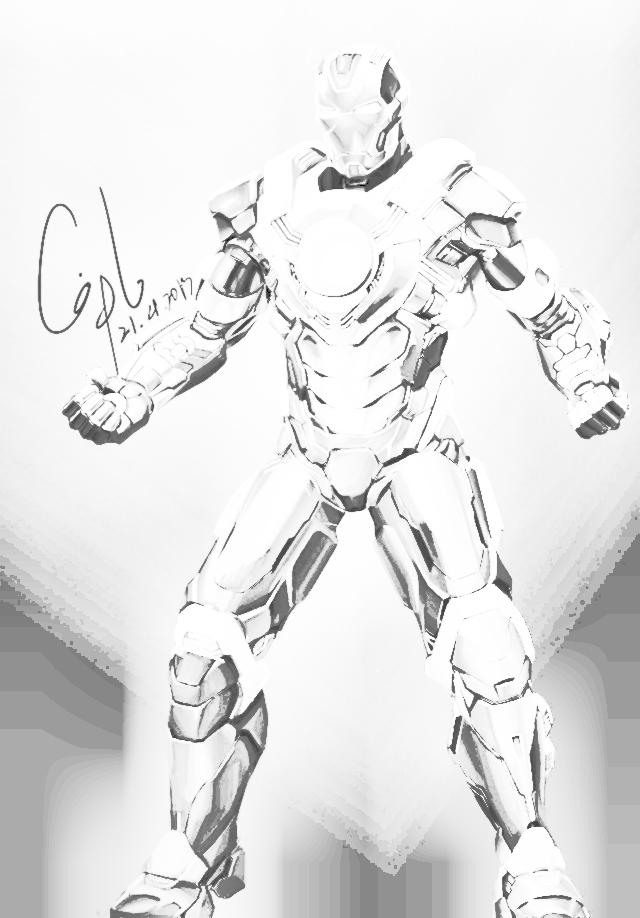
    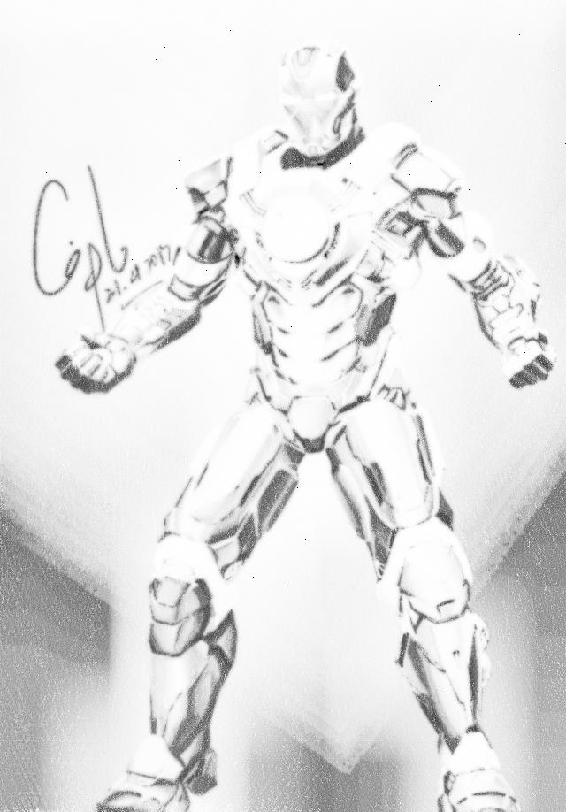
    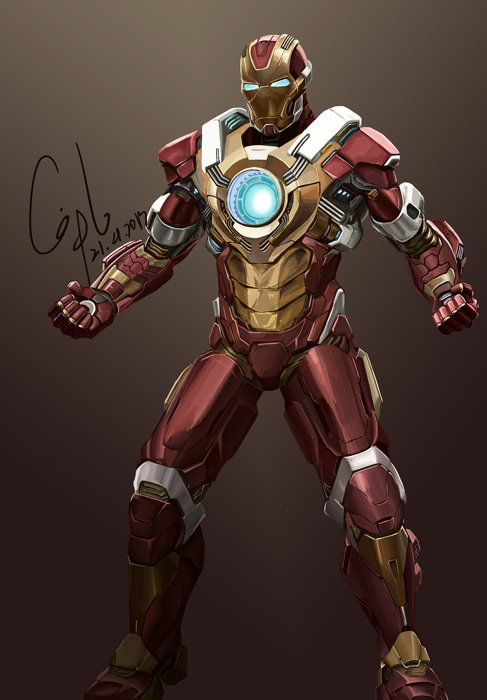
    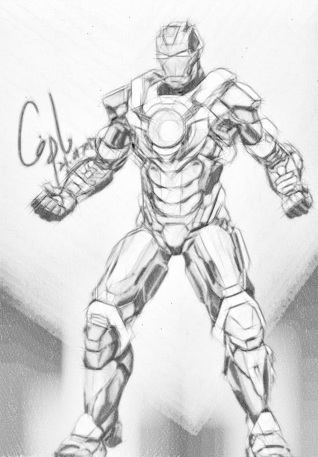

My life is brilliant

	
    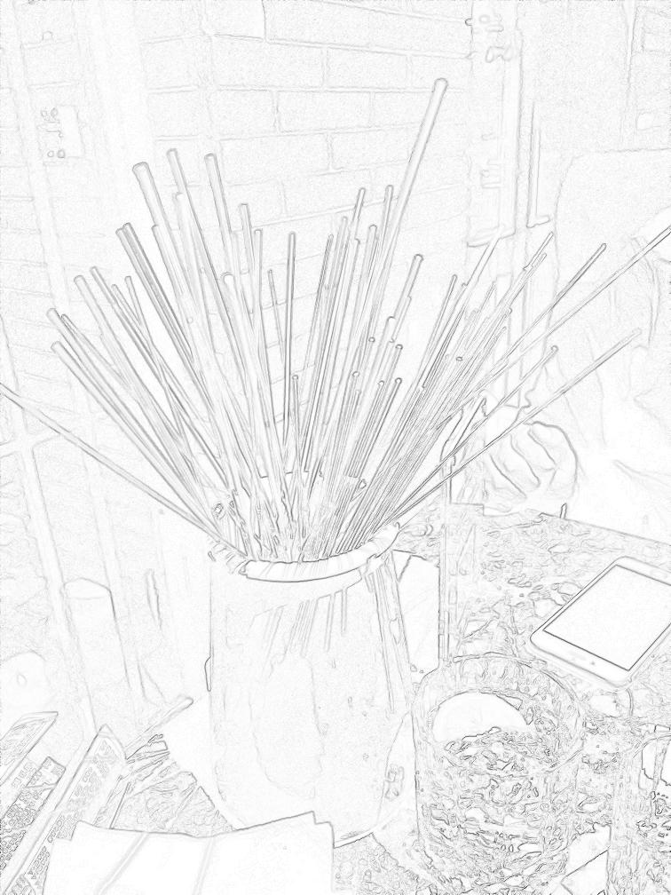
    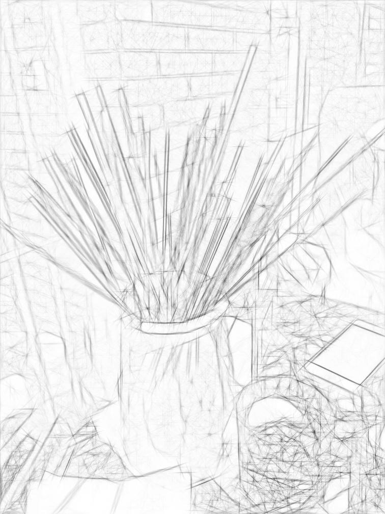
    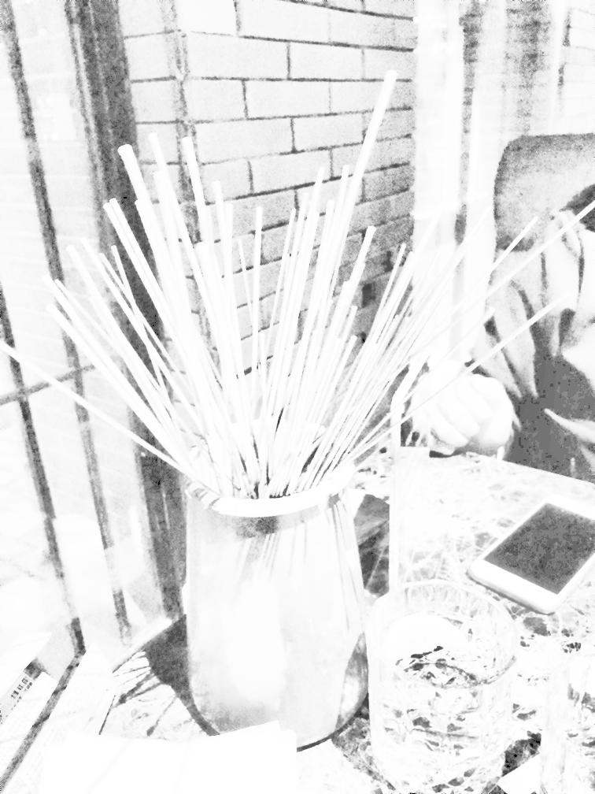
    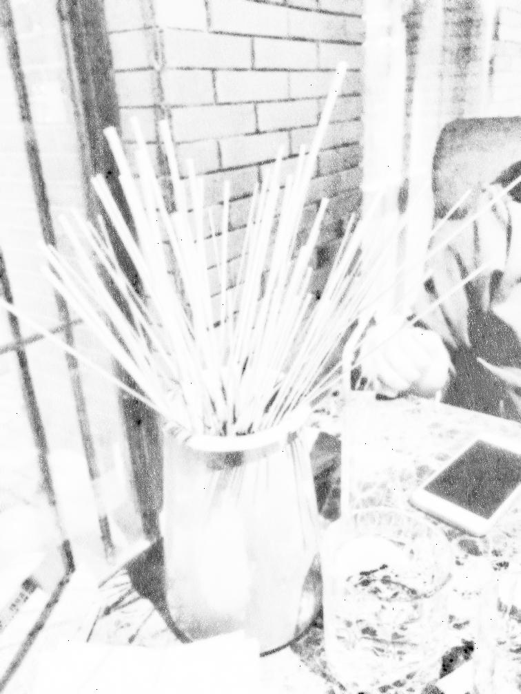
    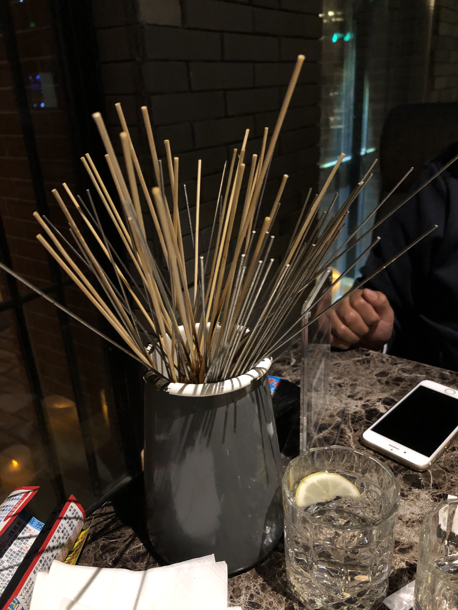
    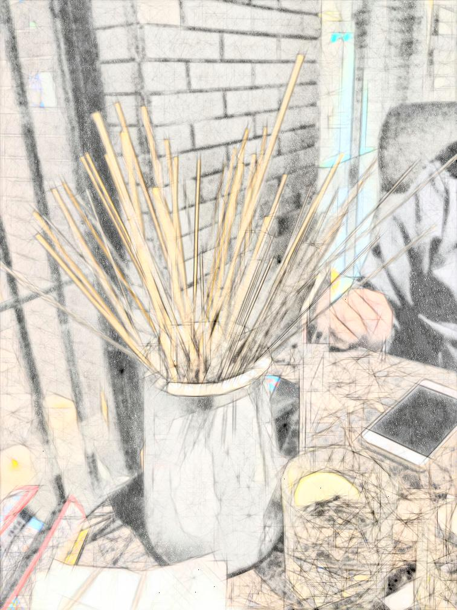

